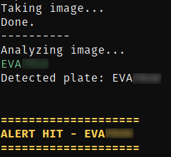
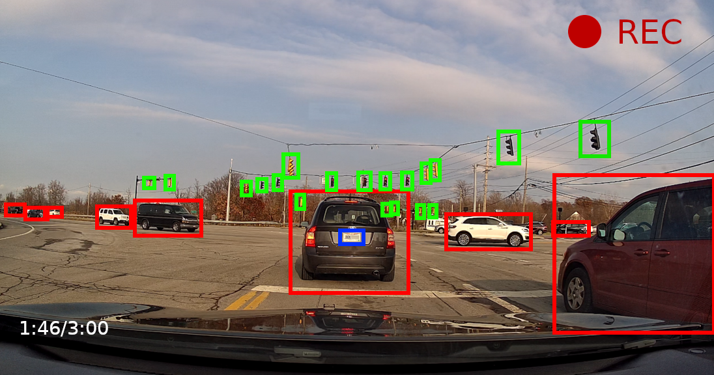
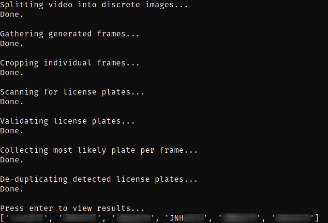

# Predator

**Copyright 2023 V0LT - Conner Vieira**

An offline, privacy centric license plate recognition platform.

[Download](https://v0lttech.com/predator.php)

## Disclaimer

While Predator is designed to be stable and reliable, you should not depend on it for safety or security critical tasks. See the [SECURITY.md](SECURITY.md) document for more information.

## Description

Predator is a multipurpose camera platform focused on license plate reading and object recognition. Predator can analyze pre-recorded video from dashcams, security cameras, or other devices, as well as real-time video streams from live vehicle-mounted cameras and fixed webcams. In addition to video analysis, Predator is also capable of acting as a traditional dash-cam or security camera, eliminating the need to install multiple devices for a single usage situation. When installed in a vehicle, Predator can seamlessly detect objects and license plates as you drive, sending you alerts automatically based on customizable criteria. When installed as a stationary security camera, Predator can run in the background, and use push notifications or audio alerts to indicate important events.

## Modes

Predator is an extremely versatile platform, and supports several different modes to better support all situations and use cases.

### Management Mode (0)

Management mode isn't a primary mode of Predator, but it allows the user to configure, maintain, and manage Predator from within the program.

### Pre-recorded Mode (1)

Pre-recorded mode allows Predator to analyze pre-recorded video, and detect license plates and objects.

### Real-time Mode (2)

Real-time mode allows Predator to detect license plates and objects in real-time video streams.

### Dash-cam Mode (3)

Dash-cam mode allows Predator to record video without running any analysis or computer-vision processing.

## General Features

### Lightweight

The Predator interface uses very little resources, allowing the majority of your processing power to remain available for license plate recognition, object detection, and database analysis.

### Offline

Predator works entirely offline, and never needs to connect to the internet to function. All internet based functionality is entirely optional and non-critical to normal operation.

### Free

Predator is completely free to use, and contains absolutely no advertising or data mining of any kind.

### Open Source

Predator is free and open source from top to bottom, and is free software, meaning you can make changes and distribute them to others freely.

### Generic

By design, Predator doesn't require specialized hardware to run. While higher resolution cameras will obviously yield better results, any video format supported by FFMPEG will work with Predator.

### Easy

While being technically mindedly will certainly help, Predator doesn't require professional installation or setup to function. As long as you're reasonably experienced with the Linux command line, setting up Predator should be a piece of cake.

### Private

Since Predator is open source, self hosted, offline, and self contained, you can rest assured that it's completely private, and it doesn't collect any of the information you provide it.

### Multipurpose

Predator is deliberately designed to be multipurpose. It can operate both as an analysis tool for pre-recorded video, as well as a real-time monitoring program. Predator can even act as a standalone dashcam when license plate reading is not needed.

### Customizable

Predator is extremely customizable, making it easy to fit into any use case. Whether you want an intelligence security camera, or a powerful dashcam device, Predator can be adjusted to fit your needs.

### Mobile

Predator is designed to support low-energy-usage hardware such that it can be easily installed in a vehicle. A single USB port is enough to power an entire Predator system.

### Location Aware

Predator supports GPX files to allow for correlating license plates detected in pre-recorded video to their physical coordinates. This makes information gathered from analyzing long streams of dashcam video much more useful and effective.

### Alerts

Predator supports customizable real-time alerts, allowing the user to be notified when a license plate matching one on a list is detected through audible sound alerts, visual cues, and push notifications!

### Safe

Predator is designed to be safe, regardless of the installation context. It's easy to configure Predator to completely hands (and eyes) free, ensuring that you don't have to look away from the road when Predator runs in a mobile context.

### Dashcam

Predator comes with a dash-cam mode, allowing for customizable real-time recording without processing license plates. Dash-cam videos can later be processed by Predator in pre-recorded mode. Predator's dash-cam mode allows for multi-channel recording, provided the hardware supports it, making it easy to simultaneously record multiple angles using multiple cameras.

### Headless Ready

While Predator comes with a straight forward interface, it can be fully configured to run in headless mode, without any user interaction necessary. This makes it perfect for vehicle installations, where the driver wants Predator to automatically start when the vehicle turns on without any user input, especially when paired with a compatible user interface.

### Object Recognition

In addition to license plate scanning, Predator also supports general object recognition. It can collect a list of common objects and save them to a file, making it easy to find important events.

### Documented

Predator's extreme customizability can be a bit overwhelming to new users. For this reason, Predator is extensively documented, and comes bundled with step-by-step guides on how to download it, install it, configure it, and run it.

### Dependable

While it shouldn't be trusted with safety critical tasks, Predator is designed to be extremely dependable regardless. When configured appropriately, steps are taken to decrease the likelihood that Predator will fail to alert to a true positive due minor mistakes in the analysis.

## Screenshots

### Real-time Mode Alert

When operating in real-time mode, Predator can display alerts when it detects a plate found in a configured database.

### Pre-recorded Mode Sample Image

While operating in pre-recorded mode, Predator can analyze any video, including dashcam video. Note that the screenshot below is for demonstrative purposes, and shows what kinds of information Predator can detect. It does not accurately reflect the Predator user interface.

### Pre-recorded Sample Analysis

After scanning through an entire pre-recorded video based on user-configured preferences, Predator can display and export all of the plates it detected.

